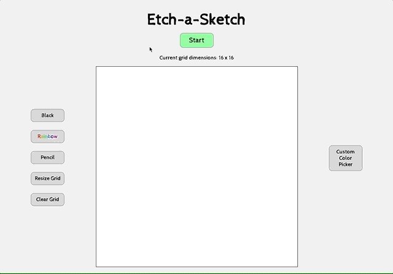

# Etch-a-Sketch

This application is a pixel drawing board, built upon the concept of the famous Etch-a-Sketch. Users can adjust the dimensions of the canvas, change colors, start and stop the drawing mechanism, and clear the board.

This project is part of the Odin Project [curriculum](https://www.theodinproject.com/paths/foundations/courses/foundations/lessons/etch-a-sketch-project). The purpose of this project was to build DOM manipulation skills using JavaScript.

## Link to Live Application
[Etch-a-Sketch](https://grinninbarrett.github.io/etch-a-sketch)

## Table of Contents
  * [Technologies](#technologies)
  * [Functionality](#functionality)
  * [Things I Learned](#things-i-learned)
  * [Future Development](#future-development)
  * [Contact](#contact)
  * [License](#license)

## Functionality

## Technologies

&nbsp;
&nbsp;
&nbsp;

## Things I Learned

- One of the biggest hurdles with this project was one of the first things that needed to be done: create the drawing grid using JavaScript. The concept is simple, but it took a lot of digging and effective Googling to find the JS syntax needed to pull it off. Once I found the right combination of tricks, it wasn't so hard.
  - Specifically, I ended up using <code>gridContainer.style['grid-template']</code> along with <code>repeat</code> to get it to work inside the nested <code>for</code> loops.
- At first, after making the "rainbow" option for the pen, it would work but then stop working after resizing the grid. So you'd resize the grid and still have the rainbow pen equipped, but it would be stuck on whatever the last randomly generated color was. I had to figure out how to properly recall the functions for the rainbow pen after calling the <code>resizeGrid</code> function. 
- A similar problem occurred with the "pencil" option. When I first got the function to properly shade the cells upon each successive hover, it wouldn't reset each cell's lightness upon clearing or resizing the grid. I had to implement a kind of counter using <code>setAttribute</code> and <code>getAttribute</code> which would reset upon clearing or resizing the grid, which got it to work just fine.
- I wanted the layout to be flexible even when the screen is manually resized. The responsive design of the page wasn't "responsive" enough. Specifically, when the window was resized, it would change the layout as per the CSS, but the grid wouldn't be redrawn automatically to make a more appropriate size for that window size. I added a resize event listener to the window element, which allowed the functions to be recalled upon window resizing. Initially, this resulted in extremely reduced performance, because the functions were being called every time the window was resized (resizing by even a pixel would call the functions again, so resizing the window by several hundred pixels would result in those functions running hundreds of times). I fixed this by using <code>setTimeout</code> to check if a certain amount of time had passed after the last function call before calling them again. This greatly improved performance while still allowing the grid to be redrawn automatically when needed.
- I decided to add the ablility to choose colors manually. It seemed obvious somehow, due to the need for usability on mobile devices, that when the user wants to choose their own color to draw, the button should open a modal. I had already implemented a modal on another project, so this wasn't difficult. The logic of how this functionality should work seemed simple: use the range inputs along with r, g, and b variables to make the pen color the color of the manually chosen color. There were some things about how JavaScript works that I encountered that were a bit confusing, but through trial and error I figured out what the problems were and fixed them. Looking back, I'm a bit surprised how complicated I was making such a simple task.
- The biggest new thing I encountered with this were the range inputs, or "sliders". These are for the user to be able to manually choose individual RGB values to fully customize the color. I had never used these, but they weren't crazy difficult to understand the basics of. I think I will need to return to these to create better browser compatibility (something I need to learn more about in general).
- I'm still trying to get better and more comfortable/fluent with CSS and deciding which type of <code>display</code> is best for a given situation. The modal layout wasn't as easy to figure out as I liked. What I felt like should have only taken a couple of minutes took more like an hour. I think in my next similar project, I may try to familiarize myself with Bootstrap, but it feels somehow like I should first get really good at writing my own CSS code from scratch so I can understand what's going on "under the hood" of something like Bootstrap.

## Future Development
- Regarding the start/stop button, it might be good to add an "always on" option, so users can choose whether to need to use the start/stop button or not. This would simply disable all the code used with the start/stop button and return it to the original methods I used before adding that button. 
- I would also like to add a button for users to take a screenshot of their drawing, saving immediately to their Downloads folder.

## Contact
Email me any time with questions, comments, or cat/dog photos! - ctbarrett.tech@gmail.com

## License

&copy; 2020 Charles Tucker Barrett

[MIT License](https://opensource.org/licenses/MIT)
